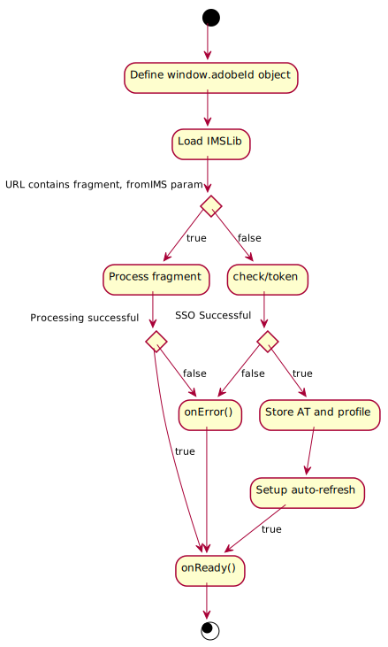
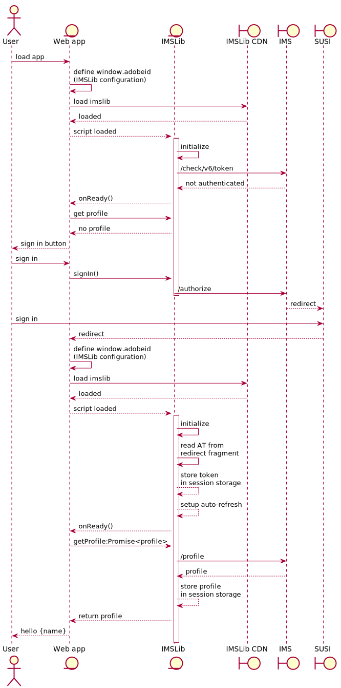

# IMSLib flows

## IMSLib initialization

This is a breakdown of the IMSLib initialization sequence

The app should define the `window.adobeId` configuration object before loading the IMSLib script (either from CDN or via import in an npm app).

Once loaded, the library will attempt to initialize automatically. 

If the loaded URI does not contain any fragment or parameters which are relevant to IMSLib (such as a token, or an authorization code), the library will run a `/check/token` request in an attempt to use the session cookie to obtain an access token and profile.

The library does not know whether or not a session cookie is present, because the session cookie is `http-only`, so it is possible that the result of the call is empty.

If the result contains the expected payload, the access token and the profile are saved into storage (by default session storage) and the auto-refresh mechanism is set up to fetch a new token automatically when the one received expires.

If the loaded URI contains a fragment and/or some query params which are relevant to IMSLib, it will assume this is a redirect from an ongoing IMS flow (such as sign in) and process it accordingly.

In either case, once the sequence is complete, the library will call the `onReady` callback defined in the configuration object.

The callback can contain, for example, calls to `getProfile` or `getAccessToken`.

## Basic SSO flow

This flow is the typical usage of IMSLib for a user that has already signed in and has a session cookie.

## Sign in flow

This flow is initialized by the client app, after IMSlib initialization - this means SSO was not possible (no session cookie present), otherwise the profile would have already been fetched, when the page loaded the IMSLib script.

This is a summarized version of the Implicit grant flow.

Note that IMSLib is initialized every time the page loads, including on the redirect after a successful sign in. However, each initialization is different: for example, on the redirect, IMSLib will read the AC from the URL fragment and exchange it for an AT, as part of the respective OAuth2 flow.

## IJT flow

Implicit jump tokens [documented here](https://wiki.corp.adobe.com/display/ims/Implicit+Jump+Tokens) provide the ability to acquire an AT for a provided jump token via a REST call.

Note that the IJT exchange does not yield a profile, if that is needed, IMSLib will make an additional call to fetch it.

